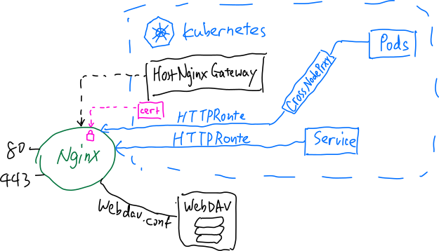

# Host Nginx Gateway

Host-nginx-gateway is a Kubernetes Gateway API implementation that uses your host-side nginx to provide HTTP routing. Existing gateways spawn their own proxy instance and exclusively hold ports like 80/443. Host-nginx-gateway reuses your host nginx to serve additional Gateways. It is designed to co-exist with your existing host-side nginx configuration, which makes it convenient for homelab users and for progressively introducing Kubernetes into an existing bare-metal setup.

> [!WARNING]
>  Do Not Use In Production: Current version is preliminary and untested.

This is a preliminary version. We are working on conformance with the [Gateway API](https://github.com/kubernetes-sigs/gateway-api).

This project is not affiliated with nginx or Kubernetes.

## Features



> [!WARNING] 
> **One Controller per Node**:  The controller claims `/etc/nginx/conf.d/k8s-gw/` exclusively; do not run two instances against the same nginx. Using DaemonSet can guarantee this. 

## Quick Start
```bash
# Install Gateway API CRDs
kubectl apply -f https://github.com/kubernetes-sigs/gateway-api/releases/download/v1.6.2/standard-install.yaml
```
Full Helm values are documented in [charts/host-nginx-gateway/README.md](charts/host-nginx-gateway/README.md).

## Prerequisites

- A Linux host with nginx installed (any layout; the controller only needs the config prefix and the pid file)
- k3s (or any cluster whose pods are reachable from the host — k3s CNI routes are used directly, no NodePort needed)
- The include line above in your `nginx.conf`
- To serve privileged ports (<1024): nginx master running as root or with `CAP_NET_BIND_SERVICE` (the controller pod itself does not need them)

## Usage

### Supported Gateway fields

| Field | Support | Notes |
|---|---|---|
| `listeners[].port` | ✅ | Authoritative; rendered as nginx `listen` |
| `listeners[].protocol` | ✅ | HTTP, HTTPS (`ssl http2`), TLS (SNI passthrough-style routing) |
| `listeners[].hostname` | ✅ | `server_name`, exact and wildcard per spec |
| `listeners[].allowedRoutes` | ✅ | `Same` (default), `Selector`, `All`; `kinds` → `supportedKinds` status |
| `listeners[].tls.certificateRefs` | ✅ | Same-namespace, or cross-namespace with ReferenceGrant |
| `spec.addresses` | ❌ | The controller reports `status.addresses` itself (`--publish-addresses` / node IP) |

### Supported HTTPRoute fields

| Field | Support | Notes |
|---|---|---|
| `hostnames` | ✅ | Intersection with listener hostname drives `server_name` dispatch |
| `rules[].matches` (path/method/headers/queryParams) | ✅ | Map chains, AND within a match, OR across matches |
| `rules[].filters` RequestRedirect / URLRewrite | ✅ | `return 30x` / `rewrite` |
| `rules[].filters` RequestHeaderModifier / ResponseHeaderModifier | ✅ | set/add/remove |
| `rules[].filters` RequestMirror | ✅ | Percentage via `split_clients`; multiple mirrors per rule |
| `rules[].backendRefs` weights | ✅ | nginx upstream `weight=` |
| `rules[].backendRefs` filters (BackendRequestHeaderModifier) | ✅ | Single-backend rules |
| `rules[].timeouts` | ✅ | GEP-1742 subset |
| Cross-namespace `parentRefs` | ✅ | Governed by `allowedRoutes` (no ReferenceGrant needed, per spec) |
| Cross-namespace `backendRefs` / TLS Secrets | ✅ | Requires ReferenceGrant |

### How it works

```
k3s API ──watch──► Full Reconciler ──► graph (IR) ──► text/template
                                                          │
                               /etc/nginx/conf.d/k8s-gw/ ◄┘
                     temp main config + nginx -t → atomic publish → nginx -s reload
```

The controller runs as a DaemonSet pod, watches Gateway resources through its in-cluster ServiceAccount, and renders the desired nginx configuration from an internal IR. Publishing validates against a temporary copy of your real `nginx.conf` (your config is never modified), replaces files atomically, signals the host nginx through the host mount namespace, and verifies new listen sockets actually came up — rolling back automatically on failure.

## Limitations

- TLSRoute, GRPCRoute, TCPRoute, and UDPRoute are not implemented (Generally they cannot be handled with Nginx mux)
- Multi-backend rules with backendRef-level header filters are rejected (stricter than required)
- Listener-level `TLS` with `BackendTLSPolicy` (upstream encryption) is out of scope
- nginx's graceful reload cannot atomically switch a port between wildcard and specific binds — change the port when changing the bind set

## License

Apache License, Version 2.0
